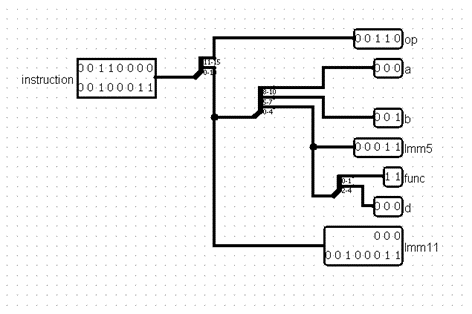

# 1. Design and Implementation

1. **Overall datapath for Single-Cycle-CPU**

    The main circuit consists of the single cycle processor consists of PC control, PC Register, Instruction Memory, Instruction Decoder, Register File, Main Control, ALU, ALU Control, Data Memory, and an Extender. All of these components work together to construct a Sigle-Cycle-CPU.

    

2. **PC Register**

    PC Register responsible for computing the right address of an instruction, and because an address should be multiple of 2, we hardwired a 0 for the LSB of each address to make sure it is multiple of 2. There are 4 cases of calculating the address of specific instruction:

    | **Case** | **Address Calculation** |
    | --- | --- |
    | **Calculating the address of next instruction** | **PC + 1** |
    | **Calculating the address of J, Jal instruction** | **PC + imm11** |
    | **Calculating the address of BEQ, BNE, BLT, BGT instruction** | **PC + imm5** |
    | **Calculating the address of Jalr instruction** | **Ra\_20\_LSB** |

    

    

3. **Instruction Memory**

    Instruction Memory is responsible for determining the instruction from the PC register. The Instruction memory only provides a read access, not write, since the datapath does not write instructions.

    

4. **Instruction Decoder**

    Instruction Decoder takes an instruction as an input and breaks down the instruction to 5 different parts for the outputs:

    **OP:** the 5-bit opcode of the instructions.

    **A:** the 3-bit value of the first source register.

    **B:** the 3-bit value of the second source register.

    **Imm5:** the 5-bit immediate for the branch and I-Type instructions.

    **Func:** the 2-bit value for function of the R-Type.

    **D:** the 3-bit value of the destination register.

    **Imm11:** the 11-bit Immediate of the J-type instructions.

    

    

5. **Register File**

    The register file is responsible for the 32-bit registers. It has 6 inputs (RegA, RegB, RegW, clk, BusW) and two outputs (BusA, and BusB). It's implemented using 7 32-bit registers, 3 BUSes and 3 Decoders. the decoder accepts a RegW signal from the main control and based on that signal it will decide which register it will write to. The decoder outputs (Except the 0th output) are connected with a RegWrite signal to AND logic gates, and each logic gate is connected the enable of a register. However, decoder's 0th output is hardwired to 0 so it will always contain the value 0. The Registers' outputs are connected to the two Busses (BusA and BusB) where the data will be transferred to the ALU or Data Memory.

    Registers' outputs are connected to the two Busses (BusA and BusB) where the data will be transferred to the ALU or Data Memory.

    

    

6. **ALU**

    The ALU as two 32-bit inputs, the fist input is from BusA from the register file. However, for the second input, it is connected from a MUX, so that the inputs can be either from BusB from the register file, or the extended 5-bit immediate, depending on the AluSrc from the Main Control Unit.

    ALU Components (instructions):

    - **AND:** Implemented using a logical AND gate with 2 inputs Ra and Rb.
    - **CAND:** Implemented using an AND gate with input Ra and ~Rb (inverted Rb).
    - **OR:** Implemented using an OR gate with inputs Ra and Rb.
    - **XOR:** Implemented using a logical XOR gate with input Ra and Rb.
    - **ADDI:** Implemented using an Adder that adds Ra and Rb together.
    - **NADDI:** Implemented using and Adder that adds Ra and -Rb (Ra + (-Rb)).
    - **LW & SW:** Implemented using an Adder to pass the address of the data in the to the data memory.
    - **SLT & SEQ:** Implemented using an arithmetic comparator that compares Ra and Rb and the result is extended to 32-bits for either Set Less Than or the Set Equal.
    - **SLL:** Implemented using a left logical shifter that takes as inputs Ra (the value) and the 5 least significant bits of Rb (shift amount).
    - **SRL:** Implemented using a right logical shifter that takes as inputs Ra (the value) and the 5 least significant bits of Rb (shift amount).
    - **Shifter (SRA)** Implemented using a right arithmetic shifter that takes as inputs Ra (the value) and the 5 least significant bits of Rb (shift amount).
    - **Shifter (ROR):** Implemented using a built-in arithmetic component that rotates the input Ra with the 5 least significant bits of Rb as the rotation amount.
    - **BEQ & BNQ:** Implemented using an Arithmetic comparator with the "Equal to" is the BEQ result, and "Equal to" inverted is the BNQ instruction.
    - **Comparator BGE & BLT:** Implemented using an Arithmetic comparator with the "Greater than" and "Equal to" are connected to a logical OR gate for the BGE result and the "Less than" is for the BLT.

    

7. **Data Memory**

    The Data Memory is used for the load and store instructions. Where it takes as inputs: the data that is being loaded, the address of that data, memory read/write signals, and the clock. The two signals determine if the instruction is either load or store, and the data is the 32-bit value from BusB. The Address, however, is the calculated result from the ALU.

    
    

8. **PC Control**

    The PC Control Unit handles everything regarding the PC register. It has two inputs, op, and zero\_flag. The Op is the opcode of the instruction, and the zero\_flag indicates whether the branch is taken or not. The output of the pc register is the PCSrc (1 for jump and 2 for taken branch).

    It contains a decoder that takes in the opcode, 3 MUXs and an OR gate. The OR gate connects the two jump instructions (J and JAL) and is connected to the second mux that has a zero\_flag signal, and that MUX is connected to a third mux that takes in a JAL signal and produces a PCSrc signal.

    

9. **ALU Control**

    The ALU Control controls the ALU by giving out an AluOp signal to choose which operation should be done by the ALU.

    

    

10. **Extender**

    The extender's inputs are the 5-bit immediate, and the ExtOp signal.

    The signal is connected to a 2-to-1 MUX to determine whether the output should be a zero-extended or a sign-extended value. The Output, however, is just the 32-bit extended value of that 5-bit immediate.

    

    

    11. **Main Control Unit**

        We have used filled ROM with values of every opcodes' signals as a decoder to generate all possible signals to control each instruction from its opcode in this datapath. In our design we chose to a ROM that works as a decoder and connected to a splitter that group signals in their specified place as shown in the table below:

        | Bits | Singal/Signals |
        | --- | --- |
        | 0-1 | WBdata |
        | 2 | MemWr |
        | 3 | MemRd |
        | 4 | AluSrc |
        | 5 | ExtOp |
        | 6 | RegWr |
        | 7-8 | RegDst |

        The Control Unit's purpose is to produce the signals to the Register file, ALU, and Data Memory. There is a single input for the 5-bit opcode, and 7 signal outputs. The outputs are as following:

        - WBdata (bit 0&1): Selects whether the data on BusW should be coming from the ALU or the Data memory.
        - MemWr (bit 2): for store instructions.
        - MemRd (bit 3): for load instructions.
        - AluSrc (bit 4): Selects whether the 2nd ALU input should be from BusB or the extended 5-bit immediate.
        - ExtOp (bit 5): Controls the extension of the 5-bit immediate
        - RegWr (bit 6): Enables the writing of the registers in the register file.
        - RegDst (bit 7 & 8): Chooses which register should be the register destination.

        

        

    **Control signals for each instruction**

    | Instruction | Op | RegDst | RegWr | ExtOp | AluSrc | MemRd | MemWr | WBdata |
    | --- | --- | --- | --- | --- | --- | --- | --- | --- |
    | **R-type** | 0, 1 | 01 | 1 | x | 0 | 0 | 0 | 00 |
    | **ANDI** | 4 | 00 | 1 | 0 | 1 | 0 | 0 | 00 |
    | **CANDI** | 5 | 00 | 1 | 0 | 1 | 0 | 0 | 00 |
    | **ORI** | 6 | 00 | 1 | 0 | 1 | 0 | 0 | 00 |
    | **XORI** | 7 | 00 | 1 | 0 | 1 | 0 | 0 | 00 |
    | **ADDI** | 8 | 00 | 1 | 1 | 1 | 0 | 0 | 00 |
    | **NADDI** | 9 | 00 | 1 | 1 | 1 | 0 | 0 | 00 |
    | **SEQI** | 10 | 00 | 1 | 1 | 1 | 0 | 0 | 00 |
    | **SLTI** | 11 | 00 | 1 | 1 | 1 | 0 | 0 | 00 |
    | **SLL**| 12 | 00 | 1 | 1 | 1 | 0 | 0 | 00 |
    | **SRL** | 13 | 00 | 1 | 1 | 1 | 0 | 0 | 00 |
    | **SRA** | 14 | 00 | 1 | 1 | 1 | 0 | 0 | 00 |
    | **ROR** | 15 | 00 | 1 | 1 | 1 | 0 | 0 | 00 |
    | **BEQ** | 16 | xx | 0 | 1 | 0 | 0 | 0 | xx |
    | **BNE** | 17 | xx | 0 | 1 | 0 | 0 | 0 | xx |
    | **BLT** | 18 | xx | 0 | 1 | 0 | 0 | 0 | xx |
    | **BGT** | 19 | xx | 0 | 1 | 0 | 0 | 0 | xx |
    | **LW** | 20 | 00 | 1 | 1 | 1 | 1 | 0 | 01 |
    | **SW** | 21 | 00 | 0 | 1 | 1 | 0 | 1 | xx |
    | **JALR** | 27 | 00 | 1 | 0 | 0 | 0 | 0 | 10 |
    | **J** | 28 | xx | 0 | x | x | 0 | 0 | xx |
    | **JAL** | 29 | 10 | 1 | 0 | 0 | 0 | 0 | 10 |
    | **IMM** | 30 | xx | x | x | x | x | x | xx |

 

# 2. Simulation and Testing

1. **Initializing Registers (Testing I-Type ALU(:**

    | **Instruction** | **Hexadecimal** | **Expected Result** |
    | --- | --- | --- |
    | `ORI R1, R0, 3` |  3023  |  R1 = 3  |
    | `ORI R7, R0, 7` |  30E7  |  R7 = 7  |
    | `CANDI R3, R1, 7` |  2967  |  R3 = 4  |
    | `ANDI R2, R1, 5` |  2145  |  R2 = 1  |
    | `XORI R4, R1, 6` |  3986  |  R4 = 5  |
    | `ADDI R6, R5, 0x0d` |  45CD  |  R6 = 0x000d  |
    | `NADDI R4, R3, 10` |  4B8A  |  R4 = 6  #result = 0xfffffff0?   #Updated the Instruction & Hex code to avoid confusion. Result = 6 |
    | `SEQI R5 R4 0x1f` |  54AF  |  R5 = 0  |
    | `SLTI R3, R6, 0x0E` |  5E6E  |  R3 = 1  |

    | **Instruction** | **Hexadecimal** | **Expected Result** |
    | --- | --- | --- |
    |  `addi $1, $0, 4`     `addi $2, $0, 3`     `and $3, $2, $1`  |  4024     4043     014C  |  $1 = 0x0004     $2 = 0x0003     $3 = 0x0000  |
    |  `addi $1, $0, 4`     `addi $2, $0, 3`     `cand $3, $2, $1`  |  4024     4043     014D  |  $1 = 0x0004     $2 = 0x0003     $3 = 0x0004  |
    |  `addi $1, $0, 4`   `addi $2, $0, 3`   `or $3, $2, $1`  |  4024   4043   014E  |  $1 = 0x0004   $2 = 0x0003   $3 = 0x0007  |
    |  `addi $1, $0, 4`   `addi $2, $0, 3`   `xor $3, $2, $1`  |  4024   4043   014F  |  $1 = 0x0004   $2 = 0x0003   $3 = 0x0007  |
    |  `addi $1, $0, 4`   `addi $2, $0, 3`   `add $3, $2, $1`  |  4024     4043     094C  |  $1 = 0x0004   $2 = 0x0003    $3 = 0x0007  |
    |  `addi $1, $0, 4`   `addi $2, $0, 3`   `nadd $3, $2, $1`  |  4024   4043   094D  |  $1 = 0x0004   $2 = 0x0003   $3 = 0x0001  |
    |  `addi $1, $0, 4`   `addi $2, $0, 3`   `seq $3, $2, $1`  |  4024   4043   094E  |  $1 = 0x0004   $2 = 0x0003   $3 = 0x0000  |
    |  `addi $1, $0, 4`   `addi $2, $0, 3`   `slt $3, $2, $1`  |  4024   4043   094F  |  $1 = 0x0004   $2 = 0x0003    $3 = 0x0001  |

2. **Testing R-Type ALU, Branches, SW, LW and J Instructions**

    **(NO RAW hazards – NO Forwarding)**

    | **Instruction** | **Hexadecimal** | **Expected Result** |
    | --- | --- | --- |
    |  `AND R4, R2, R3`  |  0270  |  R4 = 1  ##Fixed, hex updated |
    |  `CAND R7, R7, R1`  |  073D  |  R7 = 0  |
    |  `OR R3, R1, R4`  |  018E  |  R3 = 3  |
    |  `XOR R3 R1 R2`  |  014F  |  R3 = 2  |
    |  `ADD R3, R2, R1`  |  094C  |  R3= 4  |
    |  `NADD R5, R1, R3`  |  0975  |  R5 = 1  |
    |  `SEQ R6, R4, R3`  |  0C7A  |  R6 = 0  |
    |  `SLT R5, R2, R3`  |  0A77  |  R5 = 1  |
    |  `BEQ R2, R5, 4`  |  8544  |  Branch is taken   ## Make sure to leave 4 empty slots in your ROM that will be skipped.|
    |  `BNE R2, R5, 4`  |  8D44  |  Branch is not taken  |
    |  `BLT R5, R2, 6`  |  92A6  |  Branch is not taken  |
    |  `BGE R7 R3 2`  |  9BE2  |  Branch is taken  ## Make sure to leave 2 empty slots in your ROM that will be skipped. |
    |  `SW R4, 0(R5)`  |  AD80  |  Mem[R5] = R4 ##Fixed, hex updated  |
    |  `SW R2 2(R0)`  |  A862  |  Mem[2] = R2 ##Fixed, hex updated |
    |  `LW R1, 0(R5)`  |  A520  |  R1 = Mem[R5] ##Fixed, hex updated  |
    |  `JALR R2, R1`  |  D940  |
    |  `J 10`  |  E00A  |
    |  `JAL 11`  |  E80B  |
    |  `IMM 12`  |  F00C  |

    | **Instruction** | **Hexadecimal** | **Expected Result** |
    | --- | --- | --- |
    |  `addi $1, $0, 4`   `andi $2, $1, 5` | 4024   2145  |  $1 = 0x0004   $2 = 0x0004  |
    |  `addi $1, $0, 4`   `addi $2, $0, 3`   `cand $3, $2, $1`  |  4024   4043   014D  |  $1 = 0x0004   $2 = 0x0003   $3 = 0x0004  |
    |  `addi $1, $0, 4`   `addi $2, $0, 3`   `or $3, $2, $1`  |  4024S   4043   014E  |  $1 = 0x0004   $2 = 0x0003   $3 = 0x0007  |
    |  `addi $1, $0, 4`   `addi $2, $0, 3`   `xor $3, $2, $1`  |  4024   4043   014F  |  $1 = 0x0004   $2 = 0x0003   $3 = 0x0007  |
    |  `addi $1, $0, 4`   `addi $2, $0, 3`   `add $3, $2, $1`  |  4024   4043   094C  |  $1 = 0x0004   $2 = 0x0003   $3 = 0x0007  |
    |  `addi $1, $0, 4`   `addi $2, $0, 3`   `nadd $3, $2, $1`  |  4024   4043   094D  |  $1 = 0x0004   $2 = 0x0003   $3 = 0x0001  |
    |  `addi $1, $0, 4`   `addi $2, $0, 3`   `seq $3, $2, $1`  |  4024   4043   094E  |  $1 = 0x0004   $2 = 0x0003   $3 = 0x0000  |
    |  `addi $1, $0, 4`   `addi $2, $0, 3`   `slt $3, $2, $1`  |  4024   4043   094F  |  $1 = 0x0004   $2 = 0x0003   $3 = 0x0001  |

3. **Testing for**  **Fibonacci 7, ICS233-Project-Test-Cases-T211, Jumps**

    | Test | Instructions |
    | --- | --- |
    | Fibonacci 7 | v2.0 raw 3027 e804 56 a8a4 8000 3040 3061 b4c a69 413f 891d df00 |
    | ICS233-Project-Test-Cases-T211 | v2.0 raw 3023 30e7 2967 2145 3986 45cd 4b8a 54af5e6e 270 73d 18e 14f 94c 975 c7aa77 8544 0 0 0 8d44 92a6 9be20 ad80 a862 a520 d940 |
    | Jumps | v2.0 raw e00a 9\*0 e80b 10\*0 d940 |

 

# 3. Snapshots

Fetching the first instruction 0x3023 and its result in the register file

Fetching the second instruction 0x2967 and its result in the register file

Fetching the second instruction 0x8544 and its result in the register file (the branch is taken)

Fetching the second instruction 0x8544 and its result in the register file (the branch is not taken)

## ✒️ Author

| [ @M-Alhassan](https://github.com/M-Alhassan) |
| :---------------------------------------------------------------------------------------------------------------------------: |# RISC-Pipelined-Processor
